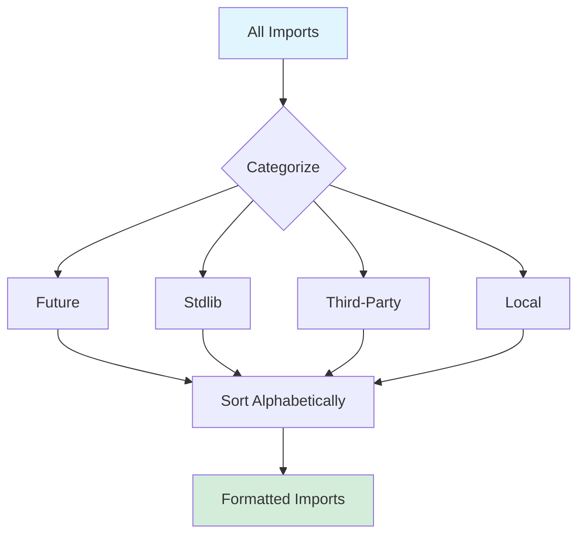
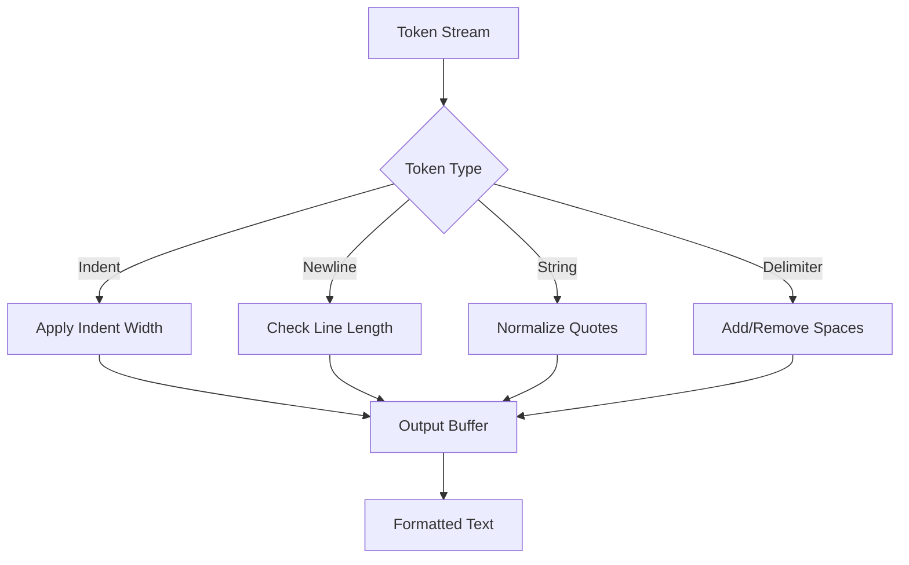

# Formatter

The formatter provides PEP8-compliant code formatting with configurable style options. It transforms Python source code into a consistent style while preserving comments and semantic meaning.

## How It Works

The formatter operates in four phases:

1. Parse source into AST and extract comments
2. Sort imports by category
3. Generate token stream from AST
4. Apply formatting rules and write output

The formatter uses tree-sitter for parsing and comment extraction, ensuring accurate preservation of all source elements.


### Import Sorting

Imports are categorized and sorted:

1. Future imports from `__future__`
2. Standard library imports
3. Third-party package imports
4. Local project imports

Within each category, imports are sorted alphabetically. This matches the style of Black and isort.



### Token Stream Generation

The AST is converted to a stream of tokens:

- Keywords: `def`, `class`, `if`, `for`, etc.
- Identifiers: variable and function names
- Literals: strings, numbers, booleans
- Operators: `+`, `-`, `==`, `and`, etc.
- Delimiters: `(`, `)`, `[`, `]`, `:`, `,`
- Whitespace: newlines, indents, dedents

Comments are attached to appropriate tokens based on their position in the source.

### Formatting Rules

The writer applies formatting rules:

- Indentation uses 4 spaces by default, configurable
- Line length defaults to 88 characters, configurable
- Two blank lines separate top-level definitions
- One blank line separates method definitions
- String quotes normalize to double quotes
- Trailing commas added in multi-line structures
- Operators surrounded by single spaces
- No spaces inside brackets/parentheses



### Caching

The formatter uses two cache layers:

Short-circuit cache checks if the source is already formatted by hashing the output. If the hash matches, formatting is skipped entirely.

Result cache stores formatted output keyed by source hash, configuration, and range. This accelerates repeated formatting of the same code.

Both caches use LRU eviction with configurable size limits.

### Configuration

Formatting behavior is controlled via `beacon.toml` or `pyproject.toml`:

```toml
[tool.beacon.formatting]
line_length = 88
indent_size = 4
normalize_quotes = true
trailing_commas = true
```

Suppression comments disable formatting:

```python
# beacon: fmt: off
ugly_code = {"a":1,"b":2}
# beacon: fmt: on
```

## Limitations

Comment preservation is best-effort. Complex nested structures with interleaved comments may lose some comments or place them incorrectly.

Line length is a soft limit. Some constructs like long string literals or deeply nested expressions may exceed the configured limit.

Format-on-type is basic and only reformats the current statement plus surrounding context. It doesn't perform whole-file formatting.

The formatter doesn't understand semantic equivalence, so it may format code in ways that change behavior for dynamic features like `globals()` manipulation.

## Key Files

```sh
crates/server/src/formatting/
├── mod.rs          # Main formatter
├── token_stream.rs # Token generation
├── writer.rs       # Output writer
├── rules.rs        # Formatting rules
├── import.rs       # Import sorting
└── cache.rs        # Result caching
```
