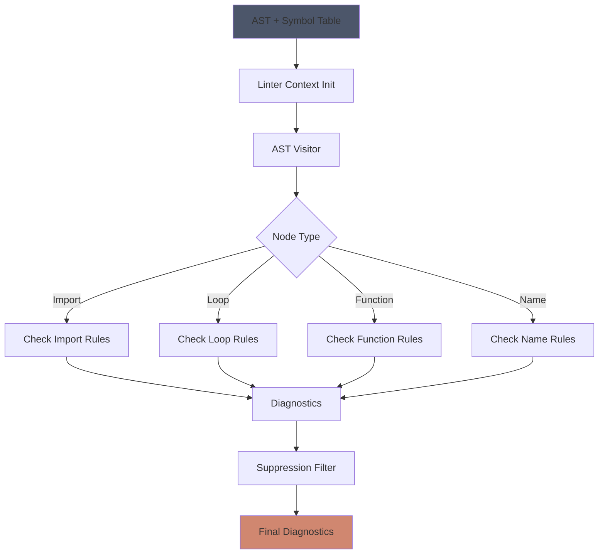
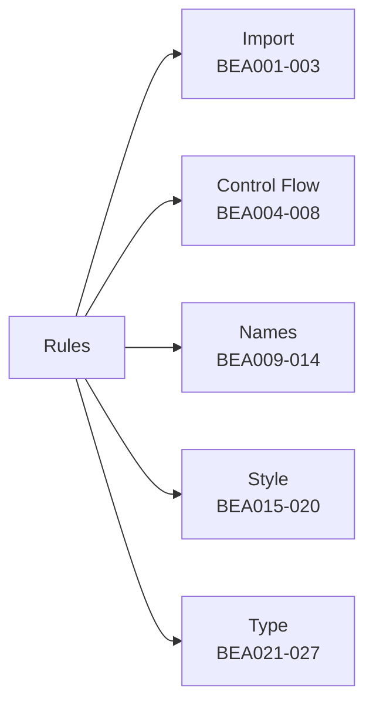
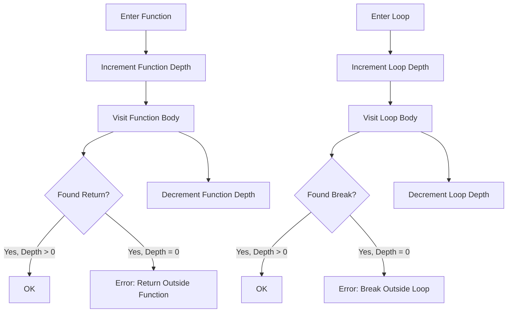

# Linter

The linter performs static code quality checks through 30 rules covering imports, control flow, naming, style, and type usage. It detects common Python mistakes and enforces best practices.

## How It Works

The linter operates in three phases:

1. Walk the AST tracking context (function depth, loop depth, imports, etc.)
2. Check symbol table for unused imports and undefined names
3. Filter diagnostics by suppression comments

Each rule is identified by a code from BEA001 to BEA030.



### Rule Categories

Import rules check for star imports, unused imports, and duplicate imports.

Control flow rules detect break/continue outside loops, return/yield outside functions, and unreachable code after control flow statements.

Name rules find undefined variables, duplicate arguments, improper global/nonlocal usage, and shadowing of builtins.

Style rules flag redundant pass statements, assert on tuples, percent format issues, forward annotations, bare except clauses, and identity comparisons with literals.

Type rules validate except handler types, detect constant conditionals, check for duplicate branches, find loop variable overwrites, and verify dataclass and protocol patterns.



### Context Tracking

The linter maintains context while walking the AST:

Function depth tracks nesting level to detect return/yield outside functions. Loop depth tracks loop nesting to validate break/continue. Class depth tracks class nesting for dataclass and protocol checks.

Import tracking records all imported names to detect unused imports. Loop variable tracking identifies which variables are bound by loop iteration. Global and nonlocal declaration tracking validates proper usage.

Assigned variable tracking finds variables written to, enabling unused variable detection. Dataclass and protocol scope tracking identifies decorated classes for specialized rules.



### Suppression

Rules can be suppressed with comments:

```python
# beacon: ignore[BEA001]  # Suppress specific rule
from module import *

# beacon: ignore  # Suppress all rules on next line
undefined_variable
```

The suppression map tracks which lines have suppressions and which rules are disabled.

### Symbol Table Integration

After AST traversal, the linter checks the symbol table:

Unused imports are detected by finding symbols marked as imported but never referenced. Undefined names are found by checking all name references against the symbol table. Shadowing detection compares local names against Python builtins.

## Limitations

Some rules use pattern matching on decorators and don't verify actual inheritance or runtime behavior. For example, dataclass detection looks for the decorator but doesn't confirm the class truly uses the dataclass module.

Constant evaluation is limited to simple literal expressions. Complex constant folding involving functions or dynamic attributes is not supported.

Control flow analysis for unreachable code is basic and may miss some cases that require interprocedural analysis.

Exception type checking in except handlers uses name-based heuristics and doesn't perform full type analysis.

The linter doesn't track data flow across statements, so it may miss patterns like conditional initialization followed by usage.

## Key Files

```sh
crates/analyzer/src/
├── linter.rs     # Main linter implementation
├── rules.rs      # Rule definitions
└── const_eval.rs # Constant evaluation
```
