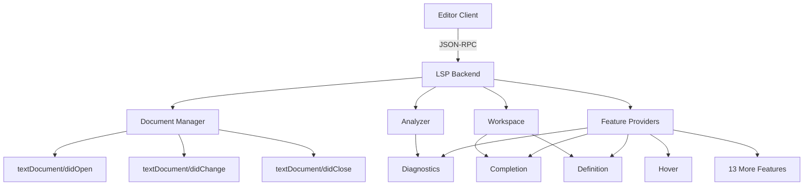
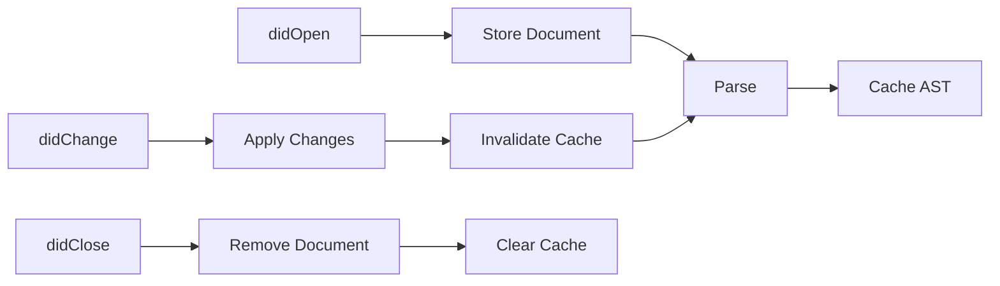
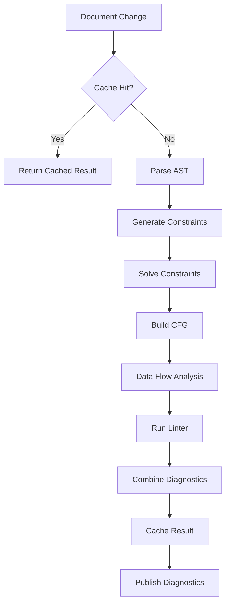
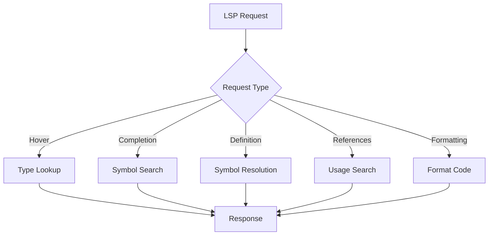

# LSP Implementation

The LSP server orchestrates all analysis components and exposes them through the Language Server Protocol. It provides 15+ features including diagnostics, hover, completion, goto definition, and formatting.

## How It Works

The server operates as a JSON-RPC service:

1. Initialize server with client capabilities
2. Manage document lifecycle (open, change, close)
3. Respond to feature requests (hover, completion, etc.)
4. Publish diagnostics when documents change
5. Index workspace for cross-file features

The backend uses tower-lsp for protocol handling and implements the LanguageServer trait.



### Document Management

The document manager tracks all open files:

When a document opens, the manager stores the URI, version, and text. When a document changes, it applies incremental or full text updates. When a document closes, it removes the document from tracking.

Each document is parsed into an AST and symbol table on demand. Parse results are cached until the document changes.



### Analysis Orchestration

The analyzer coordinates all analysis phases:

1. Retrieve cached results if available
2. Parse source into AST
3. Generate and solve type constraints
4. Build CFG and run data flow analysis
5. Run linter rules
6. Cache results by URI and version
7. Return combined diagnostics

Caching occurs at multiple levels. Full document analysis is cached by URI and version. Individual function scope analysis is cached by content hash for incremental updates.



### Feature Providers

Each LSP feature is implemented by a dedicated provider:

**Diagnostics provider** combines parse errors, type errors, linter warnings, and static analysis results into a unified diagnostic list.

**Hover provider** looks up the symbol at the cursor position in the type map and formats type information for display.

**Completion provider** searches the symbol table and workspace index for completions, filtering by prefix and ranking by relevance.

**Goto definition provider** resolves the symbol to its definition location using the symbol table and workspace index.

**References provider** finds all uses of a symbol across the workspace.

**Rename provider** validates the rename and computes workspace edits.

**Code actions provider** offers quick fixes for diagnostics like adding imports or suppressing linter rules.

**Semantic tokens provider** generates syntax highlighting tokens from the AST.

**Inlay hints provider** shows inferred types inline in the editor.

**Signature help provider** displays function parameter information during calls.

**Document symbols provider** generates an outline tree for the file.

**Workspace symbols provider** searches all symbols across the workspace.

**Folding range provider** computes collapsible regions for functions, classes, and imports.

**Formatting providers** apply code formatting to documents or ranges.



### Workspace Indexing

The workspace maintains a global index:

On initialization, the server indexes all Python files in the workspace. The index maps module names to file paths and tracks imported symbols. Import resolution uses the index to find definitions in other files.

The module resolver handles Python's import semantics, searching sys.path and resolving relative imports based on package structure.

### Configuration

Server behavior is controlled via configuration files:

```toml
[tool.beacon.type_checking]
mode = "balanced"  # strict/balanced/relaxed
unsafe_any_depth = 2

[tool.beacon.linting]
enabled = true

[tool.beacon.formatting]
line_length = 88
indent_size = 4
```

Configuration can be specified in `beacon.toml`, `pyproject.toml`, or sent via LSP workspace/didChangeConfiguration.

## Limitations

Workspace indexing is synchronous during initialization, which can cause delays on large projects with thousands of Python files.

Multi-root workspaces are not supported. Only a single workspace root is handled.

Some features degrade on files exceeding 10,000 lines of code due to parse and analysis time.

Configuration changes require server restart for some settings. Dynamic reconfiguration is not fully implemented.

Cross-file analysis is limited to import resolution and symbol lookup. Whole-program type inference is not performed.

Memory usage grows with workspace size as the index and caches expand. No automatic memory management or eviction exists for the workspace index.

## Key Files

```sh
crates/server/src/
├── backend.rs              # Main LSP backend
├── lib.rs                  # Server entry point
└── features/
    ├── diagnostics.rs      # Diagnostic generation
    ├── hover.rs            # Hover information
    ├── completion/         # Auto-completion
    ├── goto_definition.rs  # Jump to definition
    ├── references.rs       # Find references
    ├── rename.rs           # Rename symbol
    ├── code_actions.rs     # Quick fixes
    ├── semantic_tokens.rs  # Syntax highlighting
    └── formatting.rs       # Code formatting
```
