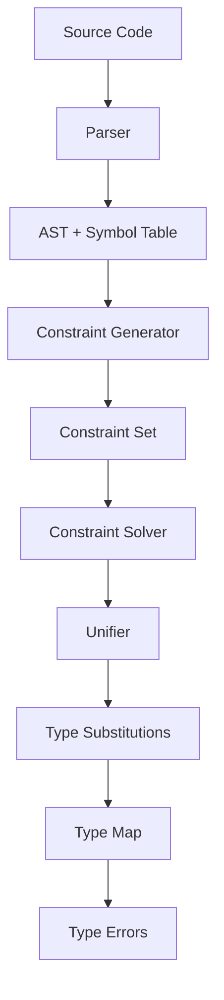
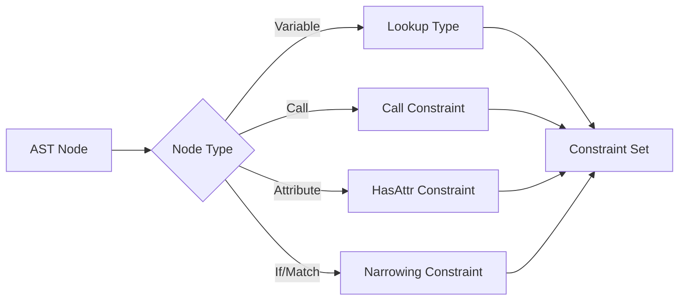

# Typechecker

The typechecker implements a Hindley-Milner type inference engine with extensions for Python's type system. It performs constraint-based type inference with gradual typing support through the `Any` type.

## How It Works

The typechecker operates in five phases:

1. Parse source code into an Abstract Syntax Tree
2. Resolve symbols and build scopes
3. Generate type constraints by walking the AST
4. Solve constraints using unification
5. Apply final type substitutions

The core algorithm uses Robinson's unification with an occurs check, extended with Python-specific features like union types, protocols, and row-polymorphic records.



### Type System

The type system supports:

- Type variables with variance annotations
- Type constructors with kind checking
- Function types with keyword arguments
- Union types for Python's `|` operator
- Row-polymorphic records for structural typing
- Protocol types for structural subtyping
- Three special types: `Any` (gradual typing), `Top` (universal supertype), `Never` (bottom type)

### Constraint Generation

The constraint generator walks the AST and produces constraints:

- `Equal(T1, T2)` - types must be identical
- `HasAttr(T, name, AttrType)` - attribute access
- `Call(FuncType, Args, Result)` - function calls
- `Protocol(T, ProtocolName, Impl)` - protocol conformance
- `MatchPattern(T, Pattern, Bindings)` - pattern matching
- `Narrowing(var, predicate, T)` - flow-sensitive typing
- `Join(var, types, T)` - control flow merge points



### Constraint Solving

The solver processes constraints in order, applying unification:

1. Process equality constraints via unification
2. Resolve attribute access using type structure
3. Check function call compatibility
4. Verify protocol conformance via structural matching
5. Handle pattern matching exhaustiveness
6. Apply type narrowing in control flow
7. Join types at control flow merge points

The unifier maintains a substitution map from type variables to concrete types, applying the occurs check to prevent infinite types.

## Limitations

Value restriction prevents generalization of mutable references, which can be overly conservative for some Python patterns.

Protocol checking handles basic structural conformance but doesn't fully support complex inheritance hierarchies with method overriding.

Type narrowing in conditionals provides basic flow-sensitive typing but lacks sophisticated constraint propagation for complex boolean expressions.

Performance degrades on files exceeding 5000 lines, though scope-level caching mitigates this for incremental edits.

The gradual typing `Any` type bypasses type checking, which can hide errors when overused.

## Key Files

```sh
crates/
├── core/
│   ├── types.rs        # Type system implementation
│   ├── unify.rs        # Unification algorithm
│   └── subst.rs        # Type substitution
├── constraints/
│   └── solver.rs       # Constraint solver
└── analyzer/
    └── walker/mod.rs   # Constraint generation
```
